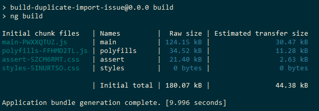
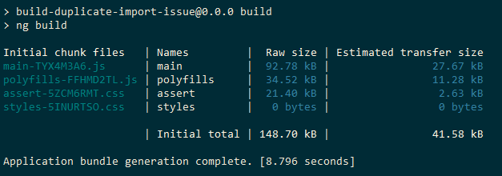

# Build 議題：Duplicate Bundle

This project was generated using [Angular CLI](https://github.com/angular/angular-cli) version 19.1.8.

若基於[程式碼分離](../build-and-split-code)，倘若將一個第三方引入同時又將其樣式樣式或程式碼綑綁是否會造成重複輸出。

## 建立應用程式專案

+ 使用 NG 開發環境建立工作區
```
angular ng
```

+ 執行專案建立指令
```
ng new build-duplicate-bundle-issue --skip-git --skip-install --style=scss --interactive=false
```
> 由於不需要建立路由，因此移除 ```--routing```

+ 使用 DEV 開發環境執行專案並啟動開發伺服器
```
angular dev --repo=build-duplicate-bundle-issue
```

## 重複包裝 ( Duplicate Bundle )

在以元件為基礎的三大框架 ( React、Vue、Angular ) 發展出來前的前端框架，前端框架其設計是奠基於瀏覽器的 Window 元件之上，並將程式碼與樣式都配置在全域環境。

然而，在以元件為基礎的框架下，講求各元件的獨立性與避免功能與樣式渲染到其他元件；但若開發時引用了舊系統的第三方，往往導致參考舊文件的方式引入，從而導致全域環境有大量的樣式汙染。

此時，若同時混用全域引入與元件引入，則會出現本次的議題重複包裝。

本範本以 [eva-icons](https://github.com/akveo/eva-icons) 為例，並分別在兩處引入並打包

+ 全域引入：在 [angular.json](./angular.json) 中的 ```projects.[project-name].architect.build.options.styles``` 添加 eva-icons 的樣式檔
+ 元件引入：在 [app.component.scss](./src/app/app.component.scss) 中宣告 ```@import``` 來引入 eva-icons 的樣式檔

結果來說，無論是全域引入、元件引入使用任一方或兩方都設定，畫面都可正常顯示樣式，但透過 ```npm run build``` 後會得到以下結果。

+ 使用元件引入



+ 未用元件引入



可以直觀的看到 main.js 增加約莫 2.8KB，約等於全域引入匯出的結果 2.6KB，實際觀察 main.js 的內容可以發現整個 assert.css 被引入其中；同理利用 jquery 在全域引入到 scripts.js，元件引入則會看到重複的 jquery 程式在 main.js 中。

Angular 系統基於 Webpack 設計包裝，考量 chunk 為基礎的打包機制中，若出現重複的 import 會避免重複打包，然而若一開始就設定為兩個輸出，就結果來說會重複打包，並分別被注入到 HTML 中。

因此，若以目前 Angular 的設計來看，main.js、styles.css、scripts.css 是三個分開的檔案，倘若重複引用只會個別處理。

## Development server
To start a local development server, run:

```bash
ng serve
```

Once the server is running, open your browser and navigate to `http://localhost:4200/`. The application will automatically reload whenever you modify any of the source files.

## Code scaffolding

Angular CLI includes powerful code scaffolding tools. To generate a new component, run:

```bash
ng generate component component-name
```

For a complete list of available schematics (such as `components`, `directives`, or `pipes`), run:

```bash
ng generate --help
```

## Building

To build the project run:

```bash
ng build
```

This will compile your project and store the build artifacts in the `dist/` directory. By default, the production build optimizes your application for performance and speed.

## Running unit tests

To execute unit tests with the [Karma](https://karma-runner.github.io) test runner, use the following command:

```bash
ng test
```

## Running end-to-end tests

For end-to-end (e2e) testing, run:

```bash
ng e2e
```

Angular CLI does not come with an end-to-end testing framework by default. You can choose one that suits your needs.

## Additional Resources

For more information on using the Angular CLI, including detailed command references, visit the [Angular CLI Overview and Command Reference](https://angular.dev/tools/cli) page.
