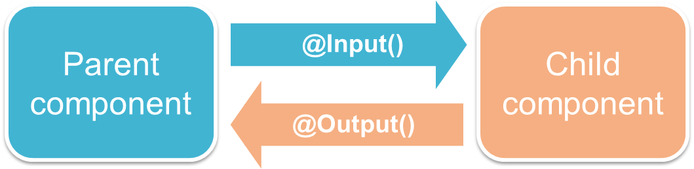

# ComponentDecoratorIo

This project was generated with [Angular CLI](https://github.com/angular/angular-cli) version 15.2.0.

## 建立開發工作區

+ 使用 NG 開發環境建立工作區
```
angular ng
```

+ 執行專案建立指令
```
ng new component-decorator-io --skip-git --skip-install --style=scss --interactive=false
```
> 由於不需要建立路由，因此移除 ```--routing```

+ 使用 DEV 開發環境執行專案並啟動開發伺服器
```
angular dev --repo=component-decorator-io
```

Angular CLI 運用於建立應用程式，而開發伺服器則是檢視修正內容的即時呈現，兩者會是需要同時啟動的服務；即使不使用 Docker 啟動開發容器，執行其他開發工具也會同時啟動多個命令視窗來檢閱。

## 元件輸入 ( Input ) 與輸出 ( Output ) 裝飾

+ Angular Reference
    - [@Input](https://angular.io/api/core/Input)
    - [@Output](https://angular.io/api/core/Output)
+ [Angular 2 Input(s) & Output(s) 傻傻分不清](https://ithelp.ithome.com.tw/articles/10188383)
+ [Component - Communication between child and parent components](https://worldline.github.io/angular-training/components/#communication-between-child-and-parent-components)

在 Angular 應用程式基礎中提到[雙向繫結](../base/README.md#雙向繫結)，在這概念中，對於 Component 對應的 HTML element 可運用如 ```ngIf``` 等 Angular 指令，而若對於 Compoennt 內的變數操作，則可利用 ```@Input``` 與 ```@Output``` 裝飾來做到 Component 階級間的訊息傳遞。



本範例會於顯示 App 對子元件 Counter 間的訊息傳遞，其中共有三個寫法

+ 雙向繫結
  - app-counter 宣告一個擁有 ```@Input``` 裝飾的輸入變數，可透過 ```<app-counter [(count)]=number1>``` 將 number1 內容傳遞給 app-counter，並當變數在內部變更時同步變更匯入變數本身
+ 單向繫結，事件內容寫入變數
  - app-counter 宣告一個擁有 ```@Input``` 裝飾的輸入變數，可透過 ```<app-counter [count]="number2">``` 將 number2 內容傳遞給 app-counter
  - app-counter 宣告一個擁有 ```@Output``` 裝飾的事件觸發器，可透過 ```<app-counter (countChange)="number2=$event">``` 讓觸發器對應改變在 app 中的 number2 變數
+ 單向繫結，事件內容匯入處理函數
  - app-counter 宣告一個擁有 ```@Input``` 裝飾的輸入變數，可透過 ```<app-counter [count]="number3">``` 將 number3 內容傳遞給 app-counter
  - app-counter 宣告一個擁有 ```@Output``` 裝飾的事件觸發器，可透過 ```<app-counter (countChange)="onCountChanged($event)">``` 讓觸發器對應改變在 app 中的 onCountChanged 處理函數

## Development server

Run `ng serve` for a dev server. Navigate to `http://localhost:4200/`. The application will automatically reload if you change any of the source files.

## Code scaffolding

Run `ng generate component component-name` to generate a new component. You can also use `ng generate directive|pipe|service|class|guard|interface|enum|module`.

## Build

Run `ng build` to build the project. The build artifacts will be stored in the `dist/` directory.

## Running unit tests

Run `ng test` to execute the unit tests via [Karma](https://karma-runner.github.io).

## Running end-to-end tests

Run `ng e2e` to execute the end-to-end tests via a platform of your choice. To use this command, you need to first add a package that implements end-to-end testing capabilities.

## Further help

To get more help on the Angular CLI use `ng help` or go check out the [Angular CLI Overview and Command Reference](https://angular.io/cli) page.
