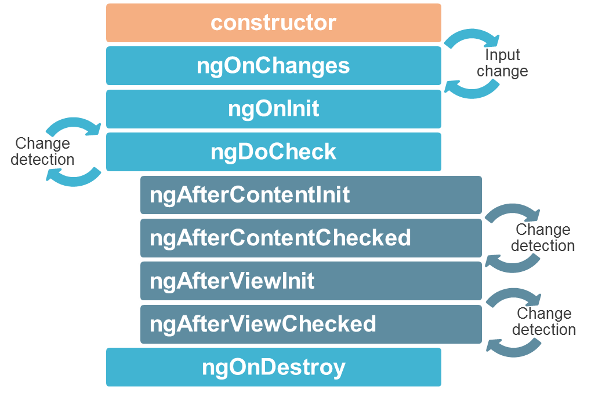

# ComponentLifecycle

This project was generated with [Angular CLI](https://github.com/angular/angular-cli) version 15.2.0.

## 建立開發工作區

+ 使用 NG 開發環境建立工作區
```
angular ng
```

+ 執行專案建立指令
```
ng new component-lifecycle --skip-git --skip-install --style=scss --interactive=false
```
> 由於不需要建立路由，因此移除 ```--routing```

+ 使用 DEV 開發環境執行專案並啟動開發伺服器
```
angular dev --repo=component-lifecycle
```

Angular CLI 運用於建立應用程式，而開發伺服器則是檢視修正內容的即時呈現，兩者會是需要同時啟動的服務；即使不使用 Docker 啟動開發容器，執行其他開發工具也會同時啟動多個命令視窗來檢閱。

## 生命週期

+ [Lifecycle hooks](https://angular.io/guide/lifecycle-hooks)
  - [Components Lifecycle](https://worldline.github.io/angular-training/components/#lifecycle)

元件生命週期是指當元件經由框架產生直到繪製內容的一連串經由框架觸發的同步函數；需注意，生命週期函數內若有執行異步函數，從而導致當前函數完成執行有所延遲，這並不會影響其他生命週期函數的執行，亦即會發生所有 onInit 首先執行，但執行結束在其他生命週期函數之後。



本範例會於生命週期中觸發必要函數來顯示資訊。

+ 開啟瀏覽器於 [localhost](http://localhost/)
+ 開啟開發模式 Ctrl + Shift + i
+ 檢視 Console 內容

## Development server

Run `ng serve` for a dev server. Navigate to `http://localhost:4200/`. The application will automatically reload if you change any of the source files.

## Code scaffolding

Run `ng generate component component-name` to generate a new component. You can also use `ng generate directive|pipe|service|class|guard|interface|enum|module`.

## Build

Run `ng build` to build the project. The build artifacts will be stored in the `dist/` directory.

## Running unit tests

Run `ng test` to execute the unit tests via [Karma](https://karma-runner.github.io).

## Running end-to-end tests

Run `ng e2e` to execute the end-to-end tests via a platform of your choice. To use this command, you need to first add a package that implements end-to-end testing capabilities.

## Further help

To get more help on the Angular CLI use `ng help` or go check out the [Angular CLI Overview and Command Reference](https://angular.io/cli) page.
